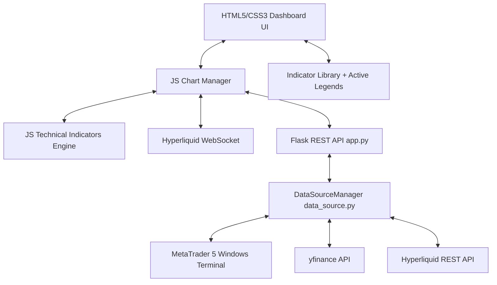
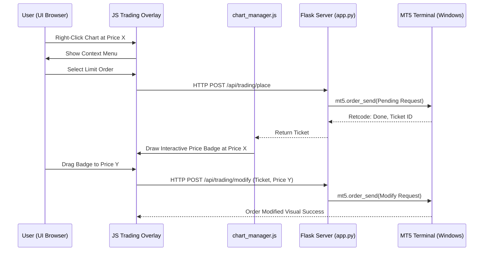

# Quant Trading Technical Architecture Guide

This document describes the high-level architecture, design patterns, and engineering details of **Quant Trading**.

---

## 🏛️ System Overview

Quant Trading uses a hybrid **Python Flask backend + client-side ES6 JavaScript** architecture designed for low-latency market analysis and local broker communication:



### Key Engineering Decisions

1. **Client-Side Quantitative Engine**: Rather than calculating technical indicators on the server, all calculations are performed locally in the browser via `static/js/indicators.js`. This:
   - Eliminates backend server bottlenecks and scales perfectly to 8+ simultaneous charts.
   - Saves expensive server CPU cycles, enabling the Flask app to run smoothly as a lightweight local proxy.
   - Allows instant parameter recalculation when indicators settings are tweaked, with zero network latency.
2. **Synchronized Multi-Pane Grid**: Orchestrated by `static/js/chart_manager.js`, the dashboard supports dynamic layout re-scaling (1, 2, 4, 6, or 8 panes) using a template clone method combined with Lightweight Charts lifecycle controls.
3. **TradingView-style indicator management**: Each pane owns saved indicator state, settings, visibility, and oscillator panel sizes. Active overlays render a top-left chart legend; visible panel indicators render header controls inside their panel.
4. **Draggable Visual Badging for MT5 Trading**: Order tickets and active positions are rendered as absolute-positioned DOM element badges inside a dedicated `trading-overlay-container` directly on top of the charting canvas. Draggable events map client coordinates to chart prices dynamically, enabling intuitive visual execution.

---

## 📊 Client-Side Multi-Pane Orchestration

The dashboard leverages a unified template mounting mechanism:

### 1. Grid Resizing and Pane Lifecycles
* **Grid Rendering**: When the user selects a pane layout (e.g. 6 panes), `updateGridCount(count)` is triggered.
* **Component Clones**: The manager clones the `<template id="chart-pane-template">` from `index.html`, assigns it a unique `data-pane-id` (e.g. `pane-0`, `pane-1`), and mounts it within the grid.
* **Cleanup and Destroy**: When resizing down, obsolete panes are safely deleted via `destroyPane(paneId)` which terminates active WebSocket feeds, clears polling timers, removes DOM elements, and calls `chart.remove()` to prevent memory leaks in Lightweight Charts.

### 2. Time-Scale and Crosshair Synchronization
To allow unified multi-timeframe or multi-asset inspection, the chart manager synchronizes all active charts:
* **Time Scale Sync**: When the user zooms or scrolls a pane, the visible logical range is propagated to all other active panes via `syncTimeScales(pane)`.
* **Crosshair Position Sync**: When the user hovers over a chart, a custom subscriber `subscribeCrosshairMove` tracks the hover price and time and updates the crosshair coordinates on all other charts in real-time, facilitating perfect spatial alignment.

### 3. Historical Backfill
Each pane subscribes to Lightweight Charts logical range changes. When the visible range approaches the left edge, `wireHistoryBackfill(pane)` calls `loadOlderCandles(pane)`, which requests older bars from:

```text
/api/historical?source=<source>&symbol=<symbol>&timeframe=<tf>&limit=300&before=<first_visible_time>
```

The returned candles are merged by timestamp, sorted ascending, and re-applied to the primary series. The previous logical range is shifted by the number of inserted candles so the user does not lose visual context while dragging back in time.

### 4. Indicator Library, Legends, and Panels
`INDICATOR_DEFS` in `static/js/chart_manager.js` is the UI contract for built-in indicators. It defines the indicator name, short label, category, render kind (`overlay` or `panel`), default settings, and editable fields.

State is persisted per pane:
- `ag_pane_indicators_<id>`: active indicator keys.
- `ag_pane_indicator_settings_<id>`: configured inputs and colors.
- `ag_pane_indicator_visibility_<id>`: hide/show state without deleting settings.
- `ag_pane_oscillator_sizes_<id>`: panel heights after drag-resize.

Overlay indicators show active legend controls on the chart. Panel indicators show controls in the oscillator header; when hidden, they remain listed in the main legend so the user can show them again.

---

## 🔌 Data Ingestion Pipeline

Quant Trading handles three distinct data pipelines with unique characteristics:

| Pipeline | Type | Protocol | Format | Usage |
| :--- | :--- | :--- | :--- | :--- |
| **MetaTrader 5** | Bid/Ask Tick | HTTP Polling | JSON REST | High-fidelity FX/CFD pricing & order flow |
| **Hyperliquid** | Order Book | WebSockets | JSON WS | Low-latency cryptocurrency order books |
| **Yahoo Finance** | Bar Close | HTTP Fetch | JSON REST | Indian Equities & Global Indices |

### Real-Time Update Logic
- **WebSocket Feeds**: Hyperliquid channels subscribe directly to public feeds (e.g., `wss://api.hyperliquid.xyz/ws`). New ticks feed into the primary series via `series.update()`, and volume bars adapt in real time.
- **REST Polling**: For sources without native browser WebSockets (such as local MT5 connection or Yahoo Finance), the client initiates a polling loop (`startLivePolling`) every 1.5 seconds to query the Flask API for the latest bid/ask.

---

## 📐 Drag-and-Drop MT5 Visual Trading Engine

The visual trading engine is a standout feature, enabling drag-and-drop order placement and modification on MetaTrader 5 charts:



### Draggable Mathematics (Coordinate Mapping)
Lightweight Charts does not natively support interactive HTML elements within its canvas. Quant Trading bridges this by placing a translucent `trading-overlay-container` directly over the canvas:
1. **Price to Coordinate**: The chart's `priceToCoordinate` API maps financial prices to pixel-level Y coordinates inside the container.
2. **Drag Event Binding**: Badges are absolute-positioned using this coordinate. A `mousedown` event initiates drag tracking.
3. **Coordinate to Price**: As the user drags the badge, the Y coordinate is recalculated and mapped back to a raw financial price using the `coordinateToPrice` API.
4. **Debounced Network Dispatches**: When released, a `POST` request is sent to `/api/trading/modify` to update the Stop Loss (SL), Take Profit (TP), or entry price in MT5.
