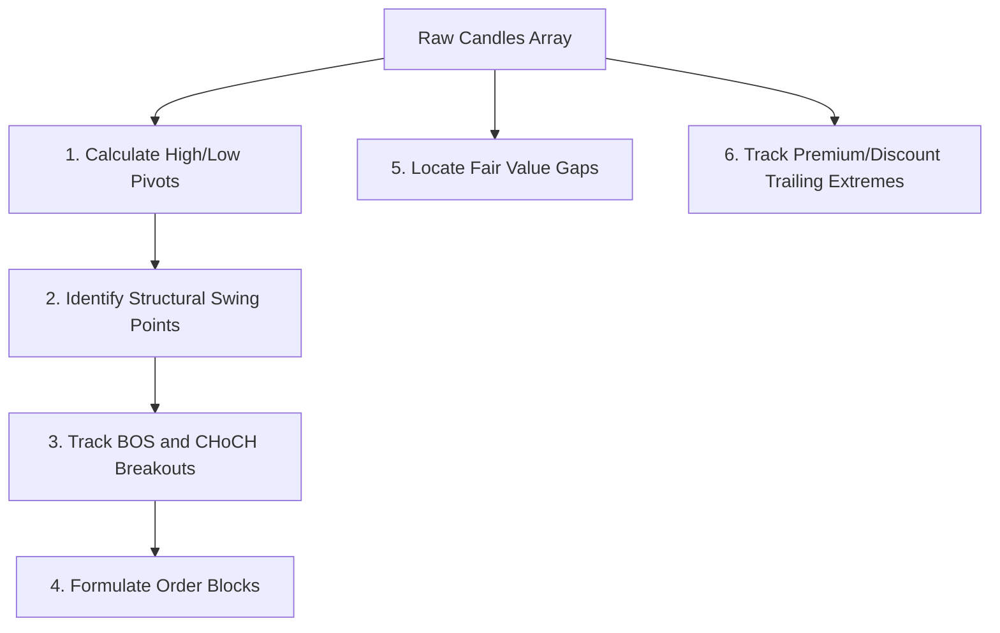

# Client-Side Quantitative Indicators Engine

This document provides a comprehensive mathematical and algorithmic reference for the in-browser indicator suite located in `static/js/indicators.js`.

---

## 📈 Architecture Rationale

All technical and market structure indicators in Antigravity are computed directly on the client side using pure, modern ES6 JavaScript.

### Key Advantages:
1. **Zero Server Compute Overheads**: Processing hundreds of candles across multiple panes and timeframes requires significant CPU resources. Running this client-side keeps the backend proxy server extremely lightweight.
2. **Instant Re-Rendering**: When settings are modified, indicators recalculate and re-render instantly without waiting for network round-trips.
3. **No Database Dependencies**: Historical data arrays are directly parsed from historical data feeds, and indicators are fed with plain Javascript objects in the format:
   ```typescript
   interface Candle {
       time: number; // Unix timestamp in seconds
       open: number;
       high: number;
       low: number;
       close: number;
       volume: number;
   }
   ```

---

## 📐 Standard Technical Overlays

### 1. Simple Moving Average (SMA)
Calculates the arithmetic mean of closing prices over a sliding window of length $N$:
$$\text{SMA}_i = \frac{1}{N} \sum_{j=0}^{N-1} \text{Close}_{i-j}$$

### 2. Exponential Moving Average (EMA)
Calculates a weighted average where weights decrease exponentially for older values. Seeding uses the SMA of the initial period:
$$\alpha = \frac{2}{N+1}$$
$$\text{EMA}_i = (\text{Close}_i \times \alpha) + (\text{EMA}_{i-1} \times (1 - \alpha))$$

### 3. Bollinger Bands (BB)
Measures market volatility. Consists of a Middle Band (SMA), and Upper/Lower Bands offset by a standard deviation multiplier ($K$, typically 2):
$$\mu_i = \text{SMA}_i(20)$$
$$\sigma_i = \sqrt{\frac{1}{N} \sum_{j=0}^{N-1} (\text{Close}_{i-j} - \mu_i)^2}$$
$$\text{Upper Band}_i = \mu_i + K\sigma_i$$
$$\text{Lower Band}_i = \mu_i - K\sigma_i$$

### 4. Volume Weighted Average Price (VWAP)
Intraday VWAP tracks the true average price scaled by transaction volumes:
$$\text{VWAP}_i = \frac{\sum_{k=0}^{i} (\text{Typical Price}_k \times \text{Volume}_k)}{\sum_{k=0}^{i} \text{Volume}_k}$$
Where $\text{Typical Price}_k = \frac{\text{High}_k + \text{Low}_k + \text{Close}_k}{3}$.

---

## 📊 Standard Technical Oscillators

### 1. Relative Strength Index (RSI)
Measures the velocity and magnitude of directional price movements over a period $N$ (usually 14):
$$\text{RS}_i = \frac{\text{Smooth Gain}_i}{\text{Smooth Loss}_i}$$
$$\text{RSI}_i = 100 - \frac{100}{1 + \text{RS}_i}$$
*Smoothing uses Wilder's Exponential Smoothing formulation:*
$$\text{Smooth Gain}_i = \frac{\text{Smooth Gain}_{i-1} \times (N-1) + \text{Gain}_i}{N}$$

### 2. Moving Average Convergence Divergence (MACD)
Calculates directional momentum by subtracting a slow EMA from a fast EMA.
$$\text{MACD Line}_i = \text{EMA}_i(12) - \text{EMA}_i(26)$$
$$\text{Signal Line}_i = \text{EMA}_i(\text{MACD Line}, 9)$$
$$\text{Histogram}_i = \text{MACD Line}_i - \text{Signal Line}_i$$

---

## 📐 Smart Money Concepts (SMC) Engine Deep-Dive

The custom SMC engine implements key logic from the professional LuxAlgo Pine Script suite to identify institutional market structure.



### 1. High/Low Pivots & Swing Confirmations
To define structural points without lookahead bias, the engine uses a sliding window of length $S$ (default 50).
- **Swing High**: A candle high is confirmed as a Swing High at index $i$ if it has the highest `high` compared to all preceding $S$ bars:
  $$\text{Candle}_{i-S}.\text{high} > \max(\text{Candles}_{[i-S+1, \ i]}.\text{high})$$
- **Swing Low**: A candle low is confirmed as a Swing Low at index $i$ if it has the lowest `low` compared to all preceding $S$ bars:
  $$\text{Candle}_{i-S}.\text{low} < \min(\text{Candles}_{[i-S+1, \ i]}.\text{low})$$
Confirmations update the state machine variables: `swingHigh` and `swingLow` representing the latest structural levels.

### 2. Break of Structure (BOS) & Change of Character (CHoCH)
Breakouts track directional shifts in trend bias:
- **BOS (Break of Structure)**: Confirms trend continuation. Occurs when a candle close penetrates a confirmed structural high/low of the *same* direction as the current trend.
- **CHoCH (Change of Character)**: Confirms trend reversal. Occurs when a candle close penetrates a confirmed structural high/low of the *opposite* direction, marking a macro shift in market bias.

### 3. Order Blocks (OBs) & Mitigations
Order Blocks represent zones of institutional buying or selling pressure:
- **Internal / Swing OBs**: When a bullish breakout (BOS/CHoCH) occurs, the engine scans backward to find the lowest low candle that initiated the upward move. This candle's High-Low boundary defines a Bullish Order Block zone.
- **Mitigation Logic**: An Order Block remains active on the chart until a subsequent candle penetrates its boundaries. Under the `High/Low` mitigation standard, a bullish OB is invalidated (mitigated) as soon as any candle's `low` breaches the OB's lowest price level.

### 4. Fair Value Gaps (FVG)
FVGs identify structural inefficiencies where price moved too rapidly, leaving imbalance:
- **Bullish FVG**: Occurs when the low of candle $i$ is higher than the high of candle $i-2$, with candle $i-1$ being a strong bullish expansion bar:
  $$\text{Low}_i > \text{High}_{i-2}$$
- **Bearish FVG**: Occurs when the high of candle $i$ is lower than the low of candle $i-2$, with candle $i-1$ being a strong bearish expansion bar:
  $$\text{High}_i < \text{Low}_{i-2}$$

---

## 🛠️ Monotonic Time Requirement (Resolved Charting Crash)

In standard charts, drawing shapes like rectangles is straightforward. However, **TradingView Lightweight Charts** does not have a native rectangle primitive. To construct boxes or segments, developer workarounds often map multi-point lines.

### The Crash
A prior implementation of `drawBox` attempted to draw a closed box using a single `LineSeries` by feeding coordinates in the pattern:
`{time: start, value: top} -> {time: end, value: top} -> {time: end, value: bottom} -> {time: start, value: bottom} -> {time: start, value: top}`

This resulted in time indices looping backwards (`end -> start`), violating the fundamental constraint of Lightweight Charts: **All series data must be strictly sorted chronologically (monotonically increasing time values).** This threw `Uncaught Error: Value is null` inside the charting engine's rendering thread and completely blacked out the browser window.

### The Solution
We solved this by splitting each zone/box into two separate, parallel, strictly time-ascending series:
1. **Top Border Series**: Plotted strictly from `{time: start, value: top}` to `{time: end, value: top}`.
2. **Bottom Border Series**: Plotted strictly from `{time: start, value: bottom}` to `{time: end, value: bottom}`.

This architecture ensures total rendering safety, eliminates crashes, and maintains high rendering performance.
